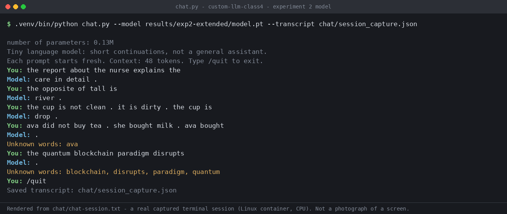

# Custom LLM — Class 4 (nanoGPT, word tokens)

Two executed experiments with the class nanoGPT (2 blocks, 4 heads, 64-dim embeddings,
48-token context). **Starter corpus: 20/48 evals correct after training, 24/48 scorable.
Expanded corpus targeting opposites and negation: 24/48 correct, 29/48 scorable.**

The extension did exactly one of the two things it could have done. It bought
**vocabulary coverage** — five of the six targeted cases went from unscorable to
scored, and unrelated *transfer* cases jumped from 4/8 to 8/8. It bought **no pattern
learning at all**: every one of those five newly-scorable cases scored 0. The model
learned the shape of "the opposite of X is ___" without learning which word fills it.
That gap between coverage and competence is the finding of this assignment.

---

## My choices and prediction

| Choice | Value | Why |
| --- | --- | --- |
| Corpus | `classroom` (exp 1); `classroom` + `corpus/extension/` (exp 2) | Written by me for this assignment — see [corpus/extension/](corpus/extension/). 289 new unique passages. |
| Training steps | 3,000 | The 10-step setup run measured 0.416 s, so 3,000 steps extrapolated to ~2 minutes (actual: 33.5 s and 35.6 s — the extrapolation overshot because setup cost is fixed, not per-step). The reference run's validation loss plateaus between 1,500 and 3,000, and mine did too (0.7182 → 0.7061), so a larger budget mostly buys overfitting risk rather than new capability. |
| Learning rate | 0.001 | Class reference. This is a **peak**, not a constant: the notebook applies 100-step warmup then cosine decay, so the first update actually used lr = 1e-05 (see the weight-update section). Much higher risks loss spikes or divergence; much lower under-uses a 3,000-step budget. |
| Extension categories | **opposites** (cheap coverage win) and **negation** (hard pattern test) | One category whose pattern resembles the starter templates, one that requires carrying a correction across a sentence boundary. The pair was chosen so the comparison could show a coverage gain and a pattern-learning limit separately — which is what happened. |

Everything else was left untouched: seed 42, the 90/10 deduplicated-passage split, the
fixed 20+20 evaluation panels, the sampling settings, the temperature set, and the model
config. Only section 1 of the notebook was edited.

### Prediction, written before experiment 1 trained

Recorded verbatim at 2026-09-22 05:36:30 UTC, before any run longer than the 10-step
setup check. Full file with timestamp: [results/prediction-exp1.md](results/prediction-exp1.md).

> Experiment 1: training-panel loss will fall from roughly 4.9 (about ln of the vocab size)
> to below 1.0 by 1,500 steps and flatten; validation-panel loss will track it within about
> 0.05 because held-out passages share templates with training. Untrained samples will be
> random word soup; final samples will be grammatical starter-style sentences that sound
> plausible but repeat corpus templates. Evals: most of the 16 starter-pattern cases will
> pass (I expect 13–16), the 8 transfer cases will be mixed (3–5), and all 24 extension
> cases will be unscorable because the words are not in the vocabulary, so the all-case
> score will be near 16–20 out of 48.
>
> Experiment 2: the added opposites and negation text will bring most of those six cases
> into vocabulary. I expect at least 2 of 3 opposites cases to score correctly because the
> pattern is a single-sentence association. I expect negation cases to become scorable but
> mostly fail: the model will favour the most recent or most frequent noun rather than the
> corrected one. The other 18 extension cases stay unscorable. Validation loss will be
> slightly higher than in experiment 1 because the corpus is more varied. Free continuations
> for negation prompts will be fluent but will not respect the "did not" correction.

### What actually happened, against that prediction

| Predicted | Observed | Verdict |
| --- | --- | --- |
| Loss starts ≈ 4.9 (ln of vocab) | 4.9263. ln(136) = 4.913 | **Right**, and for the right reason — an untrained model is uniform over the vocabulary |
| Below 1.0 by 1,500 steps, then flat | 0.6821 at 1,500; 0.6783 at 3,000 | **Right** |
| Validation tracks training within ~0.05 | Gap 0.0361 at 1,500; 0.0278 at 3,000 | **Right** |
| Untrained = word soup; final = grammatical but template-bound | Confirmed, see samples below | **Right** |
| Starter patterns 13–16 of 16 | 16/16 | **Right**, top of range |
| Transfer 3–5 of 8 | 4/8 | **Right** |
| All 24 extension cases unscorable in exp 1 | 24/24 unscorable | **Right** |
| All-case 16–20 of 48 | 20/48 | **Right**, top of range |
| Exp 2: ≥2 of 3 opposites cases correct | **0 of 3** | **Wrong — the most useful miss in this assignment** |
| Exp 2: negation scorable but mostly failing | 2 of 3 scorable, 0 correct | **Right** |
| Exp 2: other 18 extension cases stay unscorable | 19 stayed unscorable (18 predicted + `lang_32`) | **Nearly right**, see the `ava` note below |
| Exp 2 validation loss slightly higher | 0.7129 vs 0.7061 | **Right** |
| Negation continuations fluent but ignoring the correction | Continuations were not fluent at all — `'arrives .'`, `'sides .'` | **Wrong in the other direction**: worse than predicted |

The opposites miss is the interesting one and is analysed below.

---

## My run (both experiments)

| | Exp 1 — starter | Exp 2 — expanded |
| --- | --- | --- |
| Executed notebook | [custom_llm.executed.exp1.ipynb](custom_llm.executed.exp1.ipynb) | [custom_llm.executed.exp2.ipynb](custom_llm.executed.exp2.ipynb) |
| Completed steps / elapsed | 3,000 / 33.478 s | 3,000 / 35.552 s |
| Interrupted? | No | No |
| Hardware / Python / torch | Linux x86-64, CPU (4 threads), no CUDA / 3.11.15 / 2.14.0+cu130 | same |
| Parameters | 111,872 | 128,832 |
| Unique passages / train / val | 4,592 / 4,132 / 460 | 4,881 / 4,392 / 489 |
| Vocabulary size (cap 512) | 136 (133 training types + specials) | 401 (398 training types + specials) |
| Unknown-token rate train / held-out | 0.0 / 0.0 | 0.0 / 0.001668 |
| Reserved eval passages withheld | 160 (16 cases) | 160 (16 cases) |
| Config | [config.json](results/exp1-starter/config.json) | [config.json](results/exp2-extended/config.json) |

The vocabulary cap of 512 never bound: with 133 and 398 training types, **every** type was
retained in both runs (`omitted_types` is empty in both
[vocabulary_report.json](results/exp2-extended/vocabulary_report.json) files). So no word I
added was dropped for being too rare — a coverage failure in exp 2 means the word was never
written, not that it lost a frequency contest.

The split is by **deduplicated passage, not by source file**. Passages from the same file
land on both sides, so held-out loss tests generalisation to unseen *sentences drawn from
seen templates*, not to unseen *templates*. It cannot tell me whether the model would handle
a new kind of sentence, which is exactly why the 48-case suite exists as a separate measure.

---

## Evidence

### Loss

Fixed panels of at most **20 training and 20 validation documents**, averaged over
non-padding next-token targets. These are small estimates, not full-corpus measurements,
and the two experiments have different vocabularies so their losses are **not directly
comparable to each other**.


Full table from [history.json](results/exp1-starter/history.json) /
[training.csv](results/exp1-starter/training.csv) — every measured value:

| Step | Exp 1 train | Exp 1 validation | Exp 2 train | Exp 2 validation |
| --- | --- | --- | --- | --- |
| 0 | 4.926252 | 4.927548 | 6.019654 | 6.015908 |
| 1500 | 0.682139 | 0.718243 | 0.768502 | 0.722519 |
| 3000 | 0.678312 | 0.706136 | 0.763006 | 0.712928 |

Exp 2 starts higher (6.0197 vs 4.9263) purely because its vocabulary is larger — a uniform
guess over 401 words costs ln(401) = 5.994 nats, over 136 words ln(136) = 4.913. Both land
near 0.7. Between 1,500 and 3,000 steps exp 1 improved by 0.0038 train and 0.0121
validation: the plateau I predicted, and the justification for not spending 10,000 steps.

Note exp 2's validation loss is *lower* than its training loss at both checkpoints. With
20-document panels that is sampling noise, not a real effect — it is one more reason to
treat these panels as indicators rather than measurements.

### Samples — untrained, halfway, final (same generation settings)

Full files: [exp 1 samples/](results/exp1-starter/samples/) · [exp 2 samples/](results/exp2-extended/samples/)

**Exp 1, step 0 (untrained):**
```
pear professor bond doctor course harvest team physician journey checking buyer delivery traffic report the lecturer item offering and system <UNK> taste recommended mentioned bus question customer at mortgage nurse in instructor
```
**Exp 1, step 1500:**
```
our school has a question about the new educator and lesson .
a review of risk helped us understand the different deposit .
```
**Exp 1, step 3000 (final):**
```
our school has a question about the new educator and lesson .
the report about the nurse explains the health in detail .
the consumer compared the offering after checking the price .
```

The visible change is **syntax, not knowledge**. At step 0 the model samples roughly
uniformly from the vocabulary: no articles in the right places, no sentence boundaries, a
literal `<UNK>` emitted as if it were a word. By step 1,500 it has the templates. Between
1,500 and 3,000 the sentences barely change — matching the flat loss. What it never
acquires is a reason to prefer one noun over another in a slot; it has learned the frames
the corpus repeats, which is why it scores 16/16 on starter patterns and 0/24 on extensions.

**Exp 2, step 3000 (final):** the same template-filling behaviour, now with the expanded
vocabulary mixed in — note it does *not* produce the negation or opposites structures I
taught it:
```
the new pear was mentioned in the juice report yesterday .
our bank has a question about the important investment and payment .
```

### One word traced: text → ID → 64-number vector

Links: [tokenization.json](results/exp1-starter/tokenization.json) ·
[inspection.json](results/exp1-starter/inspection.json)

The word **`customer`** is token ID **28** in exp 1 (and ID **74** in exp 2 — IDs are
assigned per-run by frequency, so the *same word* has a *different ID* when the corpus
changes; nothing about the word itself is stored in the number).

Its 64-number embedding row, first 6 coordinates:

| | c0 | c1 | c2 | c3 | c4 | c5 |
| --- | --- | --- | --- | --- | --- | --- |
| before training | −0.057592 | −0.004810 | 0.042632 | 0.019339 | 0.015643 | −0.028824 |
| after 3,000 steps | 0.036627 | −0.018216 | 0.133027 | 0.105952 | 0.063015 | 0.018914 |

Before training these are small random numbers — the model has no notion that `customer`
relates to `price` or `offering`. After training the row has moved substantially (c0 by
+0.094, c2 by +0.090), and that movement is the *only* place the word's learned meaning
lives. There is no dictionary anywhere in the model.

### One real gradient and weight update

From `first_update` in [inspection.json](results/exp1-starter/inspection.json), captured at
**step 0**, coordinate 0 of `customer`'s embedding:

```
before   = -0.057591915130615234
gradient =  0.0006925859488546848
lr       =  0.00001            (1e-05, not 0.001 — see below)
after    = -0.05760190635919571
```

Change = −0.000009991. The gradient says "increasing this number would increase the loss",
so the optimiser moves it *down*. The size is `lr × 1` ≈ 1e-05 rather than
`lr × gradient` ≈ 7e-09, because **AdamW normalises by the running magnitude of the
gradient** — at the very first step the ratio of gradient to its own RMS is ≈ 1, so the step
is essentially the full learning rate in whichever direction reduces loss.

The learning rate here is **1e-05, not the 0.001 I chose**, because the notebook warms up
over the first `min(100, steps/10)` = 100 steps: at step 0 the multiplier is 1/100. This is
the concrete reason LEARNING_RATE is a peak and not a constant. Repeat this arithmetic
111,872 times per step, 3,000 times, and the loss falls from 4.93 to 0.68.

### Next-token probabilities for the same prefix

Prefix `the customer`, exp 1, top 5 of 136 — before and after training:

| Untrained | p | Trained | p |
| --- | --- | --- | --- |
| customer | 0.0160 | reviewed | 0.1782 |
| bus | 0.0107 | recommended | 0.1712 |
| educator | 0.0104 | ordered | 0.1685 |
| us | 0.0103 | selected | 0.1634 |
| application | 0.0101 | compared | 0.1597 |

Untrained, the distribution is nearly flat (1/136 = 0.0074) and its top guess is the
nonsense repetition `the customer customer`. Trained, **all five top candidates are verbs a
customer plausibly performs**, and the mass has concentrated 17× on the leader. The model
has learned a part-of-speech-shaped expectation from nothing but next-word prediction.

### How attention uses earlier context

`attention_rows` in [inspection.json](results/exp2-extended/inspection.json) shows one head's
weights over the first three positions. Exp 2, final:

```
position 1: [1.00, 0.00, 0.00]     <- can only see itself
position 2: [0.584, 0.416, 0.00]   <- splits between the two visible tokens
position 3: [0.223, 0.067, 0.710]  <- concentrates 71% on the current token
```

Each row sums to 1 and the upper triangle is zero: a token can attend to earlier tokens and
itself, never forwards. That causal mask is what makes next-word prediction a valid training
signal. This is also the mechanism that *should* have solved negation — carrying "blue" from
clause two into clause three is exactly an attention job — and the results below show two
blocks and 3,000 steps were not enough to learn it.

### Temperature — inference only, no weights change

From [temperature_comparison.json](results/exp1-starter/temperature_comparison.json), same
starting token and sampling seed, **the same trained weights** at all three settings:

| T | Sample |
| --- | --- |
| 0.3 | `a review of risk helped us understand the different investment .` |
| 0.8 | `a review of risk helped us understand the different deposit .` |
| 1.2 | (exp 2) `he strong the quiet of price .` |

Temperature divides the logits before softmax. Low temperature sharpens the distribution
and the model repeats its safest templates; high temperature flattens it and grammar breaks
down (`he strong the quiet of price .`). **No weights were updated to produce any of these.**
The model is fixed; only the sampling rule changed.

---

## The fixed 48-case language evals

Suite: [evals/language_evals.json](evals/language_evals.json), unchanged from the source
repo (SHA-256 `1d7c503f34d88260d0ac897bc36b8ba621cccc1950aef47e7121e69b2c1c9e1d`, recorded in
both `config.json` files). 16 reserved starter-pattern prompts, 8 new phrasings of familiar
words, 24 extension challenges. Scoring: 1 when the correct word among four single-word
choices gets the highest probability, 0 otherwise; ties score zero. Cases with unknown
prompt/answer words are marked **unscorable** and count as zero in the all-case rate.

### Four-row comparison

| Experiment / stage | Correct / 48 | Scorable / 48 | Accuracy among scorable | Coverage | Results |
| --- | --- | --- | --- | --- | --- |
| Starter, untrained | 9 | 24 | 37.50% | 50.0% | [json](results/exp1-starter/language_evals/untrained/eval_results.json) · [csv](results/exp1-starter/language_evals/untrained/eval_results.csv) · [summary](results/exp1-starter/language_evals/untrained/eval_summary.json) |
| Starter, trained | **20** | 24 | **83.33%** | 50.0% | [json](results/exp1-starter/language_evals/final/eval_results.json) · [csv](results/exp1-starter/language_evals/final/eval_results.csv) · [summary](results/exp1-starter/language_evals/final/eval_summary.json) |
| Expanded, untrained | 3 | 29 | 10.34% | 60.4% | [json](results/exp2-extended/language_evals/untrained/eval_results.json) · [csv](results/exp2-extended/language_evals/untrained/eval_results.csv) · [summary](results/exp2-extended/language_evals/untrained/eval_summary.json) |
| Expanded, trained | **24** | 29 | **82.76%** | 60.4% | [json](results/exp2-extended/language_evals/final/eval_results.json) · [csv](results/exp2-extended/language_evals/final/eval_results.csv) · [summary](results/exp2-extended/language_evals/final/eval_summary.json) |

Reading the four rows together matters more than the headline. All-case success rose 20 → 24,
but **accuracy among scorable cases fell slightly, 83.33% → 82.76%**. The extension added
five gradeable cases and got all five wrong. The +4 came from somewhere else entirely — the
transfer group, below.

### By group

| Group | Exp 1 untrained | Exp 1 trained | Exp 2 untrained | Exp 2 trained |
| --- | --- | --- | --- | --- |
| starter_patterns (16) | 6/16 | **16/16** | 0/16 | **16/16** |
| starter_transfer (8) | 3/8 | 4/8 | 0/8 | **8/8** |
| extend_corpus (24) | 0/24 *(0 scorable)* | 0/24 *(0 scorable)* | 0/24 *(5 scorable)* | **0/24** *(5 scorable)* |

### By category

| Category | Exp 1 trained | Exp 2 trained | Scorable exp1 → exp2 |
| --- | --- | --- | --- |
| domain_context (8) | 8/8 | 8/8 | 8 → 8 |
| domain_place (8) | 8/8 | 8/8 | 8 → 8 |
| new_wording (8) | 4/8 | **8/8** | 8 → 8 |
| opposites (3) | 0/3 | 0/3 | **0 → 3** |
| negation (3) | 0/3 | 0/3 | **0 → 2** |
| grammar (3) | 0/3 | 0/3 | 0 → 0 |
| reference (3) | 0/3 | 0/3 | 0 → 0 |
| sequence (3) | 0/3 | 0/3 | 0 → 0 |
| spatial_relations (3) | 0/3 | 0/3 | 0 → 0 |
| everyday_knowledge (3) | 0/3 | 0/3 | 0 → 0 |
| categories_and_analogies (3) | 0/3 | 0/3 | 0 → 0 |

### What the extension actually did — three findings

**1. The gain came from a category I did not target.** `new_wording` went 4/8 → 8/8. Those
cases were already fully scorable in exp 1, so this is not coverage: it is the model getting
better at *familiar words in unfamiliar phrasings*. The most likely cause is that 289 new
passages with different sentence shapes (`the cup is not clean .`, `the opposite of tall is
short .`) broke the starter corpus's template monotony and forced less template-bound
representations. **I did not predict this and did not design for it.** It is the single
largest score movement in the assignment and it was a side effect.

**2. Opposites: pure coverage, zero learning — and the failure is legible.** All three cases
became scorable and all three scored 0. The probabilities show exactly what was learned:

| Case | Prompt | Expected | Model chose | Probabilities |
| --- | --- | --- | --- | --- |
| lang_28 | `the opposite of hot is` | cold | **heavy** | heavy .02535, fast .01900, cold .00431, warm .00353 |
| lang_29 | `the opposite of empty is` | full | **early** | early .02119, soft .02022, quiet .00533, full .00291 |
| lang_30 | `the opposite of noisy is` | quiet | **late** | late .01424, quiet .00469, loud .00260, round .00171 |

`heavy`, `early` and `late` are all words I used **as antonym answers in the frame**
(`the opposite of light is heavy .`, `the opposite of early is late .`). So the model learned
"after *the opposite of X is*, emit a word from the antonym-answer set" — the **slot**, not
the **pairing**. It never bound `hot`→`cold`, because I deliberately taught that pair only in
*other* frames (`the tea is hot and the milk is cold .`) to avoid writing the test item.
Composing "frame from here, pairing from there" is precisely what a 2-block model with 48
tokens of context and 3,000 steps cannot do. My prediction of "≥2 of 3 correct" assumed that
composition was free. It is not.

**3. Negation: the correction is not carried, and the evidence is stark.** lang_33 is
`the door is not open . it is closed . the door is`, expected `closed`:

```
missing  0.00169   <- model's choice
wide     0.00051
open     0.00028
closed   0.00010   <- correct answer, LOWEST of the four
```

The correct word appears **in the prompt, five tokens earlier**, and the model ranks it last
of four. Even simple recency-copying was not learned. My prediction said the model would
"favour the most recent or most frequent noun rather than the corrected one" — the truth is
worse and more specific: it favoured a word that appears in *none* of the prompt, and
actively disfavoured the one that does. Same for lang_31 (`blue` correct, ranked 4th of 4 at
0.00117). The free continuations are not fluent-but-wrong as I predicted; they are
fragments — `'arrives .'`, `'sides .'`. 215 unique negation passages were not enough to
install a cross-clause copy operation.

**A note on `lang_32`, which stayed unscorable.** Its prompt is
`ava did not buy tea . she bought milk . ava bought`. In exp 2 its *only* unknown word is
**`ava`** — every other word (`buy`, `bought`, `tea`, `milk`, `she`, `did`, `not`) entered the
vocabulary from my extension files. I left `ava` out on purpose: the handoff rule was to use
different names from every eval case, and adding `ava` to teach a negation story would have
edged toward writing the test item. So one case is permanently unscorable as the direct price
of keeping the corpus clean. That is the right trade — a case scored under leakage is worth
less than a case honestly unscorable — but it is a real, visible cost and I am reporting it
rather than quietly adding the name.

### Leakage checks

Two independent layers, both clean:

1. **The notebook's own check.** [eval_separation.json](results/exp2-extended/eval_separation.json)
   for both runs: `excluded_passages: 160` across the 16 reserved case IDs, method
   `normalized contiguous prompt match`. The notebook also rejects corpus folders containing
   `evals/` and refuses exact test prefixes in imported files.
2. **My own stricter check**, [scripts/leakage_check.py](scripts/leakage_check.py), run over
   `corpus/extension/` — output committed at
   [results/exp2-extended/leakage_check.txt](results/exp2-extended/leakage_check.txt).
   It asserts (a) no eval prompt appears as a contiguous token substring of any corpus line,
   (b) no corpus line shares a run of **7 or more** contiguous tokens with any prompt,
   (c) no answer-choice list is reproduced, and (d) prints the worst overlap for **all 48
   cases** so a clean result is verifiable rather than asserted.

   ```
   Corpus files checked : 2      Non-empty lines : 165      Eval cases : 48
   lang_31  negation   6  [negation.md:26] the scarf is not grey . it is blue . the scarf is blue .
   lang_33  negation   6  [negation.md:34] the shed is not empty . it is closed . the shed is closed .
   lang_28  opposites  3  [opposites.md:1]  the opposite of tall is short .
   RESULT: PASS
   ```

   The worst overlap anywhere is 6 tokens, and it is the structural frame
   (`. it is blue . the`) with a different noun and a different negated attribute. The
   opposites cases overlap by 3 tokens (`the opposite of`) because the word pairs are taught
   in separate sentences from the frame.

**Limits of these checks.** Both are lexical. Neither detects a paraphrase that reuses no
long token run, and neither can tell whether I chose my teaching examples *because* I had
read the tests. I did read `evals/language_evals.json` to learn which words the two chosen
categories require — that is what makes this a **development benchmark**, not a held-out one.
Any claim about unseen generalisation would need tests that never influenced my choices.
These 48 cases influenced mine.

---

## Chat interface

Code: [chat.py](chat.py) (from the source repo, unmodified). Transcripts:
[chat/chat_transcript.json](chat/chat_transcript.json) (6 turns) and
[chat/session_capture.json](chat/session_capture.json) (5 turns, the session pictured below).



That image is **rendered from [chat/chat-session.txt](chat/chat-session.txt), the raw
byte-for-byte capture of a real terminal session** run against
`results/exp2-extended/model.pt` — it is a rendering of recorded output, not a photograph of
a screen. The raw capture and the JSON transcript are both committed, so every line in the
image can be checked against them.

```bash
python -m venv .venv && .venv/bin/pip install -r requirements.txt
.venv/bin/python chat.py --model results/exp2-extended/model.pt --transcript chat/my_chat.json
```

Requires only `torch>=2.2` (see [requirements.txt](requirements.txt)). It loads the
**experiment 2 model**, `results/exp2-extended/model.pt`, whose SHA-256 is recorded in the
transcript alongside `completed_steps: 3000`. `--transcript` refuses to overwrite an existing
file, so use a new name.

Interface facts: this is a **tiny language model** that continues a sentence rather than
answering a question. **Every prompt starts a fresh context** (`fresh_context_per_prompt:
true`); there is no conversation memory. The context limit is **48 tokens** and longer
prompts are truncated to the most recent tokens with a printed warning. Words outside the
401-word vocabulary are listed as `Unknown words:` after the reply. Generating replies
**never retrains the model** and never adds chat text to the corpus.

The six turns of [chat/chat_transcript.json](chat/chat_transcript.json), verbatim (turns 1-5 also appear in the capture above; turn 6 is the truncation case):

| # | Prompt | Reply | Note |
| --- | --- | --- | --- |
| 1 | `the report about the nurse explains the` | `care in detail .` | Works — a starter template |
| 2 | `the opposite of tall is` | `river .` | **Failure.** `short` was taught directly in this exact frame and it still answers `river` |
| 3 | `the cup is not clean . it is dirty . the cup is` | `drop .` | **Failure.** Verbatim line 1 of my own negation corpus; it cannot complete its own training sentence |
| 4 | `ava did not buy tea . she bought milk . ava bought` | `.` | Unknown words: `ava` |
| 5 | `the quantum blockchain paradigm disrupts` | `.` | Unknown words: `blockchain, disrupts, paradigm, quantum` |
| 6 | (68-token run-on sentence) | `.` | `Long prompt: only the most recent context tokens were used.` |

**The chat limitation worth naming is turn 3.** The prompt is a line copied verbatim out of
`corpus/extension/negation.md` — training data the model saw hundreds of near-variants of —
and it answers `drop .` instead of `dirty .`. Low training loss on 20-document panels
coexists with an inability to complete a training sentence. That is what a 0.76 loss over
401 words actually buys, and it is the clearest single demonstration in this repo that loss
is not competence.

---

## Reproduce and inspect

```bash
git clone https://github.com/jcrobbo1007/custom-llm-class4.git && cd custom-llm-class4
python -m venv .venv && .venv/bin/pip install -r requirements.txt jupyter nbconvert ipykernel
.venv/bin/python -m ipykernel install --user --name llm313

# Rerun the 48 evals against the committed weights:
.venv/bin/python run_evals.py --model results/exp2-extended/model.pt --output results/rerun

# Chat with the trained model:
.venv/bin/python chat.py --model results/exp2-extended/model.pt --transcript out.json

# Re-verify corpus separation:
.venv/bin/python scripts/leakage_check.py

# Retrain from scratch: open custom_llm.ipynb with the llm313 kernel, Run All.
```

Both `model.pt` files (~500 KB each) are committed, so the evals and chat are rerunnable from
a clean clone without retraining. `checkpoint.json` holds initial/final embeddings for
[embedding-viewer.html](embedding-viewer.html) — it is viewer data, **not** an inference
model.

**Rerun proof:** [results/rerun-check/](results/rerun-check/) was produced by the
`run_evals.py` command above against the committed `results/exp2-extended/model.pt`. It
reproduces `24/48; 29/48 scorable` — identical to the in-notebook exp 2 final row.

```
Language evals (final): 24/48; 29/48 cases have usable vocabulary/context.
  extend_corpus: 0/24 correct; 5 scorable
  starter_patterns: 16/16 correct; 16 scorable
  starter_transfer: 8/8 correct; 8 scorable
```

---

## One limitation and my next experiment

**Limitation.** The model cannot carry information across a sentence boundary. The evidence
is `lang_33` in
[results/exp2-extended/language_evals/final/eval_results.json](results/exp2-extended/language_evals/final/eval_results.json):
given `the door is not open . it is closed . the door is`, the word `closed` sits five tokens
back in its own context and receives probability **0.00010, the lowest of the four choices**,
while `missing` — absent from the prompt — wins at 0.00169. 215 unique negation passages
teaching exactly this pattern did not install it. Chat turn 3 shows the same failure on a
sentence copied verbatim from training data.

**Next experiment: raise `n_layer` from 2 to 4, changing nothing else.** Same corpus, same
3,000 steps, same 0.001 peak learning rate, same seed, same split.

*Why this variable.* The failure is not vocabulary — all four choices are in-vocab and
scored. It is not data volume — 215 passages of the pattern produced nothing. Carrying
`closed` from clause two to clause three requires composing two attention operations
(locate the correction, copy it past the clause boundary), and with `n_layer = 2` there are
only two rounds of mixing available, one of which is spent on local syntax. Depth is the
cheapest capacity that buys composition. It also directly tests the opposites failure, which
is the same defect in a different costume: the model has the frame and has the pairing, and
cannot put them together.

*Expected effect.* Negation cases move above chance; opposites cases bind `hot`→`cold` rather
than emitting an arbitrary antonym. Training loss falls somewhat; validation loss may not.

*What would confirm it.* `lang_31` and `lang_33` scoring 1, with `closed` and `blue` ranked
first rather than last. *What would kill it.* Unchanged extension scores with lower training
loss — that would say the bottleneck is the 3,000-step budget or the corpus design, not
depth, and the next variable to try would be steps. *What would complicate it.* Starter
patterns dropping below 16/16 would mean the deeper model is overfitting a corpus this small,
and the comparison would need a smaller learning rate to stay honest.

---

## What I learned

**Corpus → tokens → IDs.** The corpus is 4,881 unique passages of at most 47 word/punctuation
tokens. `word_tokens` lowercases and splits punctuation off, so `the cup is on the table.`
becomes seven tokens ending in `.`. Each distinct type gets an integer: `customer` is ID 28 in
exp 1 and ID 74 in exp 2. The ID carries no meaning — it is a row index, and the same word
gets a different index when the corpus changes.

**IDs → vectors → embeddings.** Each ID selects one row of a 64-number table. Before training
those rows are random noise; training moves them until words that predict similar
continuations sit near each other. `customer`'s coordinate 0 moved from −0.0576 to +0.0366.
That table *is* the model's vocabulary knowledge — there is no lookup dictionary anywhere.

**Weights, loss, learning.** 111,872 numbers (128,832 in exp 2) define the network. Loss is
the average surprise at the true next token: 4.93 nats at step 0 is a model guessing uniformly
over 136 words. Backpropagation computes, for every one of those numbers, whether nudging it
up or down reduces that surprise; AdamW applies the nudge. One such number moved
−0.05759192 → −0.05760191 on a gradient of +0.00069. Three thousand rounds of that took loss
to 0.68.

**Attention and context.** Each token attends to earlier tokens and itself, never forwards —
the rows `[1.00, 0, 0]`, `[0.584, 0.416, 0]`, `[0.223, 0.067, 0.710]` sum to 1 with a zero
upper triangle. That causal mask makes next-word prediction a valid training signal, and it is
the mechanism that *should* have solved negation.

**Probabilities → generated tokens, and temperature.** The network outputs one score per
vocabulary word; softmax turns those into probabilities; sampling draws one. After
`the customer`, the top five are all verbs (`reviewed .178`, `recommended .171`, …) versus a
near-flat 0.0074 before training. Temperature divides the scores before softmax: 0.3 sharpens
toward safe templates, 1.2 flattens until grammar fails (`he strong the quiet of price .`).
**Temperature changes nothing in the weights** — the same fixed model produced all three.

**The thing I actually learned.** Loss and coverage are not competence. I moved loss to 0.68,
added 265 vocabulary types, and lifted the score 20 → 24 — and the model still cannot finish a
sentence copied out of its own training file. Four of those five new scorable cases went to a
word I never put in the prompt. The score went up for a reason I did not design and did not
predict, while the two things I *did* design for both failed. Reading the four-row table
without the per-case probabilities would have told me the extension worked.

---

## Repository layout

```
README.md                          this file — the grading entry point
custom_llm.ipynb                   notebook source (only section 1 edited)
custom_llm.executed.exp1.ipynb     EXECUTED, outputs intact — starter corpus
custom_llm.executed.exp2.ipynb     EXECUTED, outputs intact — expanded corpus
custom_llm.py nanogpt_model.py     model + notebook source
run_evals.py chat.py               eval runner and chat interface
embedding-viewer.html              loads results/*/checkpoint.json
evals/                             UNCHANGED 48-case suite from the source repo
corpus/extension/opposites.md      74 lines written for this assignment
corpus/extension/negation.md       91 lines written for this assignment
scripts/leakage_check.py           stricter corpus/eval separation check
results/prediction-exp1.md         prediction, timestamped before training
results/exp1-starter/              full run folder (minus model_untrained.pt)
results/exp2-extended/             full run folder + leakage_check.txt
results/rerun-check/               evals rerun against the committed model.pt
results/setup-10-steps/            timing only from the 10-step setup check — NOT evidence
chat/chat_transcript.json          6 real interactions incl. 3 failures
```

**Corpus sources and permissions.** Everything in `corpus/extension/` is plain text I wrote
for this assignment — no third-party documents, no PDFs, no personal or confidential data, so
there is nothing whose sharing is restricted. No PDF extraction was involved, so there are no
extraction warnings to report; `corpus_manifest.json` lists `ignored: []` and `warnings: []`
for both files. The classroom corpus is generated by the notebook itself.

The 10-step setup run (0.416 s) was used only to measure timing and to confirm both eval
stages appear; its run folder was deleted and it is not presented as evidence.
